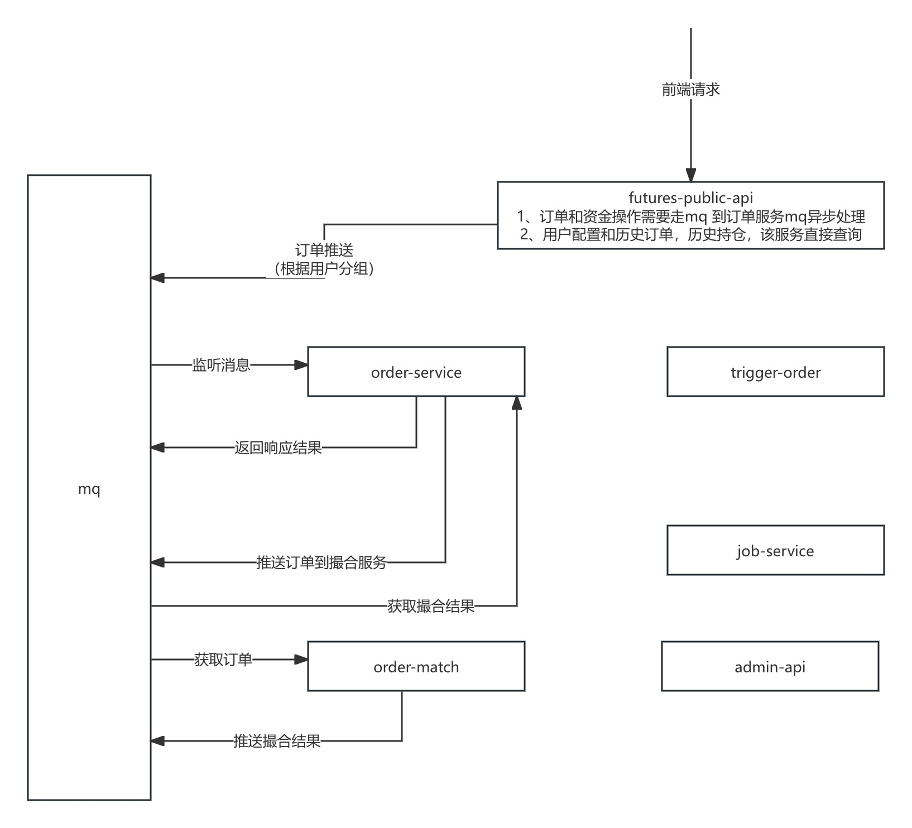

# 架构图

## 服务模块
* ### order-public-api
- 用户配置管理，历史订单查询，历史仓位查询
- 用户下单 结合DeferredResult实现异步响应的效果
* ### order-service 订单服务
用户的资产信息，当前挂单，当前持仓均保存在内存中
- 处理用户下单
- 处理资金转入转出
- 处理撮合完成后的订单
- 监控最新成交价,检查仓位爆仓
- 异步处理数据持久化
* ### order-trigger
条件单保存在内存中，监控最新成交价，并触发下单
* ### order-match
订单撮合
* ### job-service
业务系统的数据统计

## 关键模块设计
### order-service 订单服务
~~~
CREATE TABLE user
(
    id     INT(20) PRIMARY KEY,
    status INT(3) NOT NULL comment '是否冻结交易',
    group_name varchar(100) default 'g1'
);
对用户进行分组，用户签约开通后，可按照策略（指定当前时间段的分组，随机分组，轮训分组）分组
消息队列的设计：messageRequest${分组名称}
~~~
- 分组信息,有多少分组，每个每组有多个JVM（一主多从，zookeeper协调）服务实例启动更新worker_order_group_jvm确定分组
- master 重启或关闭，slave 切换成master，角色切换模式master->slave, slave->master, start->master, start->slave
- master 切换成slave 先停止消费mq的消息请求，向slave 发送切换消息。slave切换成master后，收到前master通知的后或者从异步持久化数据的队列无法拉取到数据超过1500后，开始处理用户请求
~~~
CREATE TABLE worker_order_group
(
    id         INT AUTO_INCREMENT PRIMARY KEY,
    group_name VARCHAR(50) NOT NULL,
    ctime      TIMESTAMP DEFAULT CURRENT_TIMESTAMP,
    unique key (group_name)
);

CREATE TABLE worker_order_group_jvm
(
    id               INT AUTO_INCREMENT PRIMARY KEY,
    group_name       VARCHAR(50) NOT NULL,
    ctime            TIMESTAMP DEFAULT CURRENT_TIMESTAMP,
    last_update_time TIMESTAMP DEFAULT CURRENT_TIMESTAMP,
    jvm_id           VARCHAR(200) NOT NULL default '',
    unique key (group_name,jvm_id)
);
~~~
- 处理数据的线程设置，线程数 = cpu个数，处理用户数据的线程 = uid % cpu个数 
- 订单id：要求全局唯一采用雪花算法（时间戳毫秒，机器码，序列号）
- 用户数据的版本号 txid ：用户维度单调递增，采用时间戳秒+序号，每个线程单独递增
- 仓位id 采用redis的自增序列
- 异步刷新到数据库account(资产),transfer(资金划转)，order(订单),position(仓位)，trade(成交)
- 如何确保数据正确，异步处理的数据，都需要加上txid(版本号，每次刷新都是全字段推送，最新的txid为准)
~~~
    <insert id="upsert">
        insert into co_order (id, uid, position_id, symbol, market_id, amount, volume, deal_type, deal_amount,
                              deal_volume, price_type, price, fee, status, leverage_level, side, open,
                              position_type, margin, ctime, mtime,
                              realized_amount,
                              completed_time,
                              cancel_time, cancel_order, txid)
            value (#{id}, #{uid}, #{positionId}, #{symbol}, #{marketId}, #{amount}, #{volume}, #{dealType},
                   #{dealAmount},
                   #{dealVolume}, #{priceType}, #{price}, #{fee}, #{status}, #{leverageLevel}, #{side}, #{open},
                   #{positionType}, #{margin}, #{ctime}, #{mtime},
                   #{realizedAmount},
                   #{completedTime}, #{cancelTime}, #{cancelOrder}, #{txid})
        on duplicate key update position_id      = IF(#{txid} > txid, #{positionId}, position_id),
                                status           = IF(#{txid} > txid, #{status}, status),
                                amount           = IF(#{txid} > txid, #{amount}, amount),
                                volume           = IF(#{txid} > txid, #{volume}, volume),
                                price            = IF(#{txid} > txid, #{price}, price),
                                deal_amount      = IF(#{txid} > txid, #{dealAmount}, deal_amount),
                                deal_volume      = IF(#{txid} > txid, #{dealVolume}, deal_volume),
                                fee              = IF(#{txid} > txid, #{fee}, fee),
                                status           = IF(#{txid} > txid, #{status}, status),
                                mtime            = IF(#{txid} > txid, #{mtime}, mtime),
                                realized_amount  = IF(#{txid} > txid, #{realizedAmount}, realized_amount),
                                margin           = IF(#{txid} > txid, #{margin}, margin),
                                completed_time   = IF(#{txid} > txid, #{completedTime}, completed_time),
                                cancel_time      = IF(#{txid} > txid, #{cancelTime}, cancel_time),
                                cancel_order     = IF(#{txid} > txid, #{cancelOrder}, cancel_order),
                                auto_update_time = IF(#{txid} > txid, now(), auto_update_time),
                                txid             = IF(#{txid} > txid, #{txid}, txid)
    </insert>
~~~
## 爆仓检查：
### 全仓爆仓条件满足 ： 开仓价值 * 维持持仓保证金率 >=  ( 可用余额 + 全仓冻结保证金 + sum(所有持仓浮动盈亏) )
#### 开仓价值 = 开仓数量 * 开仓价格
#### 空单浮动盈亏： 持仓数量 * (开仓价格 - 标记价格)
### 多单浮动盈亏：持仓数量 * (标记价格 - 开仓价格)
### 仓位保证金率： (可用余额 + 开仓保证金) / (开仓价值)